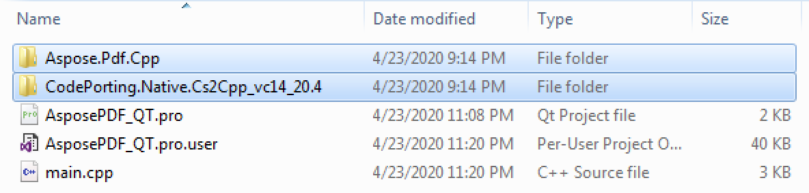
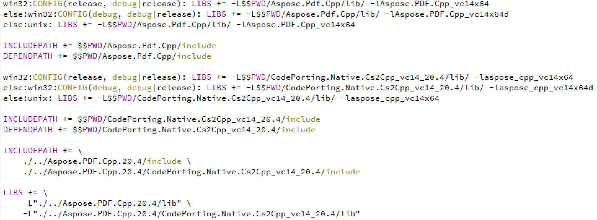

Aspose.Page for C++ can be used for creating cross-platform applications to create, read, and convert XPS files to other formats using Qt. Qt applications can target a variety of desktop, mobile, web, and embedded system applications. This article shows how to integrate our C++ Page library to work with XPS files in Qt applications.
## **Using Aspose.Page for C++ within Qt**
To use Aspose.Page for C++ in your Qt application, download the latest version of the API from the [downloads](https://downloads.aspose.com/page/cpp) section (for Windows Operating System). The API can be used with Qt using two options:

- With Qt Creator
- With Visual Studio

In this article, we show to integrate and use Aspose.Page for C++ within a Qt console application using Qt Creator.
### **Create Qt Console Application**
{} 

This article assumes that you have properly installed Qt development environment and Qt Creator.

{} 

- Open Qt Creator and create a new *Qt Console Application*.

- Select the QMake option from the *Build System* dropdown.

- Select the appropriate kit and finish the wizard.

At this point, you should have a workable executing Qt Console Application that should compile without issues.
### **Integrate Aspose.Page for C++ API with Qt**
- Extract the Aspose.Page for C++ archive that you have downloaded earlier
- Copy *Aspose.Page.Cpp* and *CodePorting.Native.Cs2Cpp_vc14_20.4* folders from the extracted package of Aspose.Page for C++ into the root of the project. Your project should like as shown in the following image.

- In order to add paths to lib and include folders, right-click on the project in LHS panel and select *Add Library*.

- Select the External Library option and browse paths to include and lib folders one by one.

- Once done, your .pro project file will contain the following entries:

- Build the application and you are done with the integration.
### **Create XPS Document in Qt**
Now that Aspose.Page for C++ has been integrated with Qt, we are ready to create an XPS document with some text and save it to disc. To do this:

- Insert the following code in main function to generate an XPS document and save to disc



 QString text = "Hello World";

// Create new XPS Document

auto doc = System::MakeObject<XpsDocument>();

//Create a brush 

System::SharedPtr<XpsSolidColorBrush> textFill = doc->CreateSolidColorBrush(System::Drawing::Color::get_Black());

//Add glyph to the document

System::SharedPtr<XpsGlyphs> glyphs = doc->AddGlyphs(u"Arial", 12.0f, System::Drawing::FontStyle::Regular, 300.f, 450.f, text.toStdU16String().c_str());

glyphs->set_Fill(textFill);

// Save resultant XPS document

doc->Save(outDir() + u"AddText_out.xps");


