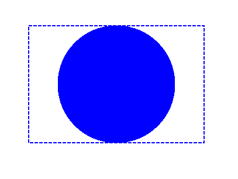

## **Add Clip in PS Document**

A clip in a PS document is a path that bounds the content of the current graphics state that will be shown in the PS viewer or editor. The content that is left beyond the bounds will be cut off.
<br>
A clipping path in .NET can be assigned in three ways:

- by **System.Drawing.Drawing2D.GraphicsPath** that can contain any closed shapes;
- by text outline;
- by 1 bpp (bits per pixel) 2-color image as a stencil mask;

At this moment Aspose.Page for .NET library offers only the first way of clipping.
In the example below we obtain a circle **System.Drawing.Drawing2D.GraphicsPath** from a rectangle as a clipping path and cut off a blue-filled rectangle in the same graphics state.
<br>

In order to add a clip to the new [PsDocument](https://reference.aspose.com/page/net/aspose.page.eps/psdocument/) with Aspose.Page for .NET library in this example we do the following steps:
1. Create an output stream for the resulting PS file.
2. Create [PsSaveOptions](https://reference.aspose.com/page/net/aspose.page.eps.device/pssaveoptions/) object with default options.
3. Create a 1-paged PsDocument with an already created output stream and save options.
4. Create a new graphics state.
5. Create a circle **System.Drawing.Drawing2D.GraphicsPath** from the rectangle.
6. Set a clip with this path.
7. Set a paint to the current graphics state of PsDocument.
8. Fill the rectangle path with the current paint.
9. Exit from the current graphics state to upper level one.
10. Translate to the place of the filled rectangle.
11. Stroke with a dashed line the bounds of the same rectangle above the filled one to show the bounds of the clipped filled rectangle.
10. Close the page.
11. Save the document.

```C#
//Create an output stream for PostScript document
using (Stream outPsStream = new FileStream(dataDir + "Clipping_outPS.ps", FileMode.Create))
{
    //Create save options with default values
    PsSaveOptions options = new PsSaveOptions();

    // Create new 1-paged PS Document
    PsDocument document = new PsDocument(outPsStream, options, false);

    //Create a graphics path from the rectangle
    System.Drawing.Drawing2D.GraphicsPath rectangePath = new System.Drawing.Drawing2D.GraphicsPath();
    rectangePath.AddRectangle(new System.Drawing.RectangleF(0, 0, 300, 200));

    //Save the graphics state in order to return back to this state after transformation
    document.WriteGraphicsSave();

    //Displace current graphics state on 100 points to the right and 100 points to the bottom.
    document.Translate(100, 100);

    //Create a graphics path from the circle
    System.Drawing.Drawing2D.GraphicsPath circlePath = new System.Drawing.Drawing2D.GraphicsPath();
    circlePath.AddEllipse(new System.Drawing.RectangleF(50, 0, 200, 200));

    //Add a clipping by the circle to the current graphics state
    document.Clip(circlePath);

    //Set the paint in the current graphics state
    document.SetPaint(new System.Drawing.SolidBrush(Color.Blue));

    //Fill the rectangle in the current graphics state (with the clipping)
    document.Fill(rectangePath);

    //Restore the graphics state to the previus (upper) level
    document.WriteGraphicsRestore();

    //Displace upper level graphics state on 100 points to the right and 100 points to the bottom.
    document.Translate(100, 100);

    Pen pen = new Pen(new SolidBrush(Color.Blue), 2);
    pen.DashStyle = DashStyle.Dash;

    document.SetStroke(pen);

    //Draw the rectangle in the current graphics state (has no clipping) above the clipped rectngle
    document.Draw(rectangePath);

    //Close current page
    document.ClosePage();

    //Save the document
    document.Save();
}
```
{}
See working with clips in PS documents in [Java](/page/java/ps/working-with-clips/) and [C++](/page/cpp/ps/working-with-clips/).
{}

The result of running this code is appeared as
</br></br></br>
<p align="center">
	
</p>
</br></br></br>

{}
You can download examples and data files from [GitHub](https://github.com/aspose-page/Aspose.Page-for-.NET). {} 
