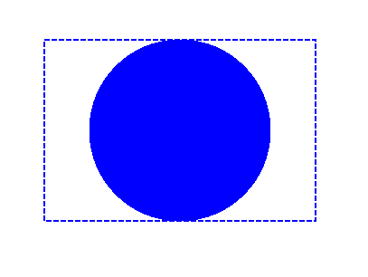

## **Add Clip in PS Document**

Clip in PS document is a path that bounds content of current graphics state that will be shown in PS viewer or editor. The content that is left beyond bounds will be cut off.
<br>
Clipping path in .NET can be assigned by three ways:

- by **System.Drawing.Drawing2D.GraphicsPath** that can contain any closed shapes;
- by text outline;
- by 1 bpp (bits per pixel) 2-colors image as stencil mask;

At this moment Aspose.Page for .NET library offers only the first way of clipping.
In the example below we obtain circle **System.Drawing.Drawing2D.GraphicsPath** from rectangle as clipping path and cut off blue filled rectangle in the same graphics state.
<br>

In order to add clip to new [PsDocument](https://reference.aspose.com/page/net/aspose.page.eps/psdocument/) with Aspose.Page for .NET library in this example we do following steps:
1. Create output stream for resulting PS file.
2. Create [PsSaveOptions](https://reference.aspose.com/page/net/aspose.page.eps.device/pssaveoptions/) object with default options.
3. Create 1-paged PsDocument with already created output stream and save options.
4. Create new graphics state.
5. Create circle **System.Drawing.Drawing2D.GraphicsPath** from the rectangle.
6. Set clip with this path.
7. Set paint to the current graphics state of PsDocument.
8. Fill rectangle path with current paint.
9. Exit from current graphics state to upper level one.
10. Translate to the place of filled rectangle.
11. Stroke with dashed line the bounds of the same rectangle above filled one to show the bounds of clipped filled rectangle.
10. Close page.
11. Save the document.

```C#
//Create output stream for PostScript document
using (Stream outPsStream = new FileStream(dataDir + "Clipping_outPS.ps", FileMode.Create))
{
    //Create save options with default values
    PsSaveOptions options = new PsSaveOptions();

    // Create new 1-paged PS Document
    PsDocument document = new PsDocument(outPsStream, options, false);

    //Create graphics path from the rectangle
    System.Drawing.Drawing2D.GraphicsPath rectangePath = new System.Drawing.Drawing2D.GraphicsPath();
    rectangePath.AddRectangle(new System.Drawing.RectangleF(0, 0, 300, 200));

    //Save graphics state in order to return back to this state after transformation
    document.WriteGraphicsSave();

    //Displace current graphics state on 100 points to the right and 100 points to the bottom.
    document.Translate(100, 100);

    //Create graphics path from the circle
    System.Drawing.Drawing2D.GraphicsPath circlePath = new System.Drawing.Drawing2D.GraphicsPath();
    circlePath.AddEllipse(new System.Drawing.RectangleF(50, 0, 200, 200));

    //Add clipping by circle to the current graphics state
    document.Clip(circlePath);

    //Set paint in the current graphics state
    document.SetPaint(new System.Drawing.SolidBrush(Color.Blue));

    //Fill the rectangle in the current graphics state (with clipping)
    document.Fill(rectangePath);

    //Restore graphics state to the previus (upper) level
    document.WriteGraphicsRestore();

    //Displace upper level graphics state on 100 points to the right and 100 points to the bottom.
    document.Translate(100, 100);

    Pen pen = new Pen(new SolidBrush(Color.Blue), 2);
    pen.DashStyle = DashStyle.Dash;

    document.SetStroke(pen);

    //Draw the rectangle in the current graphics state (has no clipping) above clipped rectngle
    document.Draw(rectangePath);

    //Close current page
    document.ClosePage();

    //Save the document
    document.Save();
}
```
{}
See working with clips in PS document in [Java](/page/java/ps/working-with-clips/) and [C++](/page/cpp/ps/working-with-clips/).
{}

The result of running this code is appeared as
</br></br></br>
<p align="center">
	
</p>
</br></br></br>

{}
You can download examples and data files from [GitHub](https://github.com/aspose-page/Aspose.Page-for-.NET). {} 
