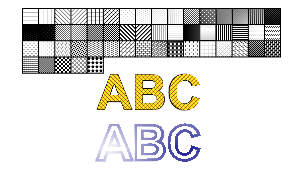

## **Add Hatch Pattern in PS Document**

Hatch pattern is a texture tiling pattern usually represented by small 2-colors (usually black&white) simple image. The main content of these small images is various hatches. 

For painting by hatches, the .NET platform has a separate class, derived from **System.Drawing.Brush**, **System.Drawing.HatchBrush**. Its difference from **System.Drawing.TextureBrush** is 
that it has named predefined styles defining what image to use for tiling. .NET platform offers 52 hatch styles and all 52 styles can be used for filling or stroking (outlining) in PsDocument.
<br>
<br>
In order to *paint* graphics objects with a hatch pattern in Aspose.Page for .NET library it is enough simply to pass **System.Drawing.HatchBrush** to **SetPaint()** or one of the **FillText()** or **FillAndStrokeText()** methods that accept **System.Drawing.Brush** as a parameter.
<br>
In order to *outline* graphics objects with a hatch pattern in Aspose.Page for .NET library someone should create new **System.Drawing.Pen** with **System.Drawing.HacthBrush** and pass it to **SetStroke()** or one of the **OutlineText()** or **FillAndStrokeText()** methods that accept **System.Drawing.Pen** as a parameter.
<br>
<br>
In the example below we demonstrate, firstly, how to fill a shape with a hatch pattern, then all variety of hatch styles in .NET, and, finally, how to fill and outline a text with a hatch pattern.
<br>

An algorithm for *painting* graphics objects with a hatch pattern in a new PS document includes the following steps:
1. Create an output stream for the resulting PS file.
2. Create [PsSaveOptions](https://reference.aspose.com/page/net/aspose.page.eps.device/pssaveoptions/).
3. Create [PsDocument](https://reference.aspose.com/page/net/aspose.page.eps/psdocument/) with the already created output stream and save options.
4. Create the necessary graphics path or font in dependence on what object we are going to fill or outline.
5. Create an object of **System.Drawing.HatchBrush** with wishful style.
6. Set the hatch brush as current paint in PsDocument
7. Fill the graphics path with current paint or fill a text. If we use one of the methods for filling a text that accepts **System.Drawing.Brush** as a parameter, the previous point can be ignored.
8. Close the page.
9. Save the document.

If we need *stroking (outlining)* graphics objects with a hatch pattern instead of the last 4 points following will be:

&nbsp;&nbsp;&nbsp;&nbsp;&nbsp;6. Create **System.Drawing.Pen** object with the hatch brush.<br>
&nbsp;&nbsp;&nbsp;&nbsp;&nbsp;7. Set this pen as current stroke in PsDocument.<br>
&nbsp;&nbsp;&nbsp;&nbsp;&nbsp;8. Outline the graphics path with current stroke or outline the text. If we use one of the methods for outlining the text that accepts **System.Drawing.Pen**
as a parameter, previous point can be ignored.<br>
&nbsp;&nbsp;&nbsp;&nbsp;&nbsp;9. Close the page.<br>
&nbsp;&nbsp;&nbsp;&nbsp;&nbsp;10. Save the document.<br>

```C#
//Create an output stream for PostScript document
using (Stream outPsStream = new FileStream(dataDir + "AddHatchPattern_outPS.ps", FileMode.Create))
{
    //Create save options with A4 size
    PsSaveOptions options = new PsSaveOptions();

    // Create new 1-paged PS Document
    PsDocument document = new PsDocument(outPsStream, options, false);

    int x0 = 20;
    int y0 = 100;
    int squareSide = 32;
    int width = 500;
    int sumX = 0;

    //Create a graphics state
    document.WriteGraphicsSave();

    //Translate the graphics state to initial point
    document.Translate(x0, y0);

    //Create a rectangle path for every pattern square
    System.Drawing.Drawing2D.GraphicsPath path = new System.Drawing.Drawing2D.GraphicsPath();
    path.AddRectangle(new System.Drawing.RectangleF(0, 0, squareSide, squareSide));

    //Create a pen for outlining pattern square
    Pen pen = new Pen(Color.Black, 2);

    //For every hatch pattern style 
    for (HatchStyle hatchStyle = 0; hatchStyle <= (HatchStyle)52; hatchStyle++)
    {
        //Set the paint with current hatch brush style
        document.SetPaint(new HatchBrush(hatchStyle, Color.Black, Color.White));

        //Calculate a displacement in order to don't go beyond the page bounds
        int x = squareSide;
        int y = 0;
        if (sumX >= width)
        {
            x = -(sumX - squareSide);
            y += squareSide;
        }
        //Translate current graphics state
        document.Translate(x, y);
        //Fill the pattern square
        document.Fill(path);
        //Set the stroke
        document.SetStroke(pen);
        //Draw the square outline
        document.Draw(path);

        //Calculate a distance from X0
        if (sumX >= width)
        {
            sumX = squareSide;
        }
        else
            sumX += x;
    }

    //Exit from current graphics state to upper level graphics state
    document.WriteGraphicsRestore();

    //Fill the text with the hatch pattern
    HatchBrush brush = new HatchBrush(HatchStyle.DiagonalCross, Color.Red, Color.Yellow);
    System.Drawing.Font font = new System.Drawing.Font("Arial", 96, FontStyle.Bold);
    document.FillAndStrokeText("ABC", font, 200, 300, brush, pen);

    //Outline the text with hatch pattern
    brush = new HatchBrush(HatchStyle.Percent50, Color.Blue, Color.White);                
    document.OutlineText("ABC", font, 200, 400, new Pen(brush, 5));


    //Close current page
    document.ClosePage();

    //Save the document
    document.Save();
}
```
{}
See working with a hatch pattern in PS document in [Java](/page/java/ps/working-with-hatch-patterns/) and [C++](/page/cpp/ps/working-hatch-patterns/).
{}

The result of running this code is appeared as
</br></br></br>
<p align="center">
	
</p>
</br></br></br>

{}
You can download examples and data files from [GitHub](https://github.com/aspose-page/Aspose.Page-for-.NET). {} 
