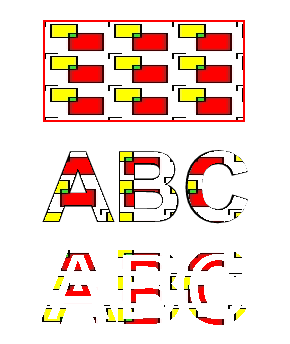

## **Add Texture Tiling Pattern in PS Document**

Texture tiling pattern is image that is used for filling or drawing objects: shapes or text. If a size of the image is less than a size of object it is repited in X and Y direction for covering all necessary area.
The process of repition of the image inside graphics objects called tiling. 
In order to set paint or stroke in [PsDocument](https://reference.aspose.com/page/net/aspose.page.eps/psdocument/) we must pass an object of **System.Drawing.Brush** class for painting and
an object of **System.Drawing.Pen** for stroking into respective methods. Aspose.Page for .NET library processes all subclasses of **System.Drawing.Brush** that are offered by .NET platform. These are **System.Drawing.SolidBrush**,
**System.Drawing.TextureBrush**, **System.Drawing.LinearGradientBrush**, **System.Drawing.PathGradientBrush** and **System.Drawing.HatchBrush**. **System.Drawing.Pen** class cannot be extended because it is sealed,
but it contains **System.Drawing.Brush** as a property and, thus, Aspose.Page for .NET library can also use complete set of brushs also for drawing lines and outlining shapes and text.
<br>
<br>
In order to *paint* graphics objects with texture pattern in Aspose.Page for .NET library it is enough simply to pass **System.Drawing.TextureBrush** to **SetPaint()** or one of the **FillText()** or 
**FillAndStrokeText()** methods which accepts **System.Drawing.Brush** as a parameter.
<br>
In order to *outline* graphics objects with texture pattern in Aspose.Page for .NET library someone should create new **System.Drawing.Pen** with **System.Drawing.TextureBrush** and 
pass it to **SetStroke()** or one of the **OutlineText()** or **FillAndStrokeText()** methods which accepts **System.Drawing.Pen** as a parameter.
<br>
<br>
In the example below we demonstrate how to fill a shape and text and outline text with texture tiling pattern.
<br>

Description of steps of working with Texture Pattern and [PsDocument](https://reference.aspose.com/page/net/aspose.page.eps/psdocument/) in the example:
1. Create an output stream for resulting PS file.
2. Create [PsSaveOptions](https://reference.aspose.com/page/net/aspose.page.eps.device/pssaveoptions/) object with default options.
3. Create 1-paged PsDocument with already created output stream and save options.
4. Create new graphics state and translate to necessary position.
5. Create **System.Drawing.Bitmap** from image file.
6. Create **System.Drawing.TextureBrush** from image.
7. Set necessary transformation in texture brush.
8. Set texture brush as current paint in current graphics state of PsDocument.
9. Create rectangle path.
10. Fill rectangle with texture brush.
11. Save current paint as local variable for future use.
12. Set current stroke with red pen.
13. Outline the rectangle with current pen.
14. Exit from current graphics state to upper level graphics state.
15. Create **system** font.
16. Fill and stroke (outline) text. For filling texture brush is used, for stroking black pen is used.
17. Outline text in other position with new **System.Drawing.Pen** created with texture brush as Brush.
18. Close page.
19. Save the document.

```C#
 //Create output stream for PostScript document
using (Stream outPsStream = new FileStream(dataDir + "AddTextureTilingPattern_outPS.ps", FileMode.Create))
{
    //Create save options with A4 size
    PsSaveOptions options = new PsSaveOptions();

    // Create new 1-paged PS Document
    PsDocument document = new PsDocument(outPsStream, options, false);

    
    document.WriteGraphicsSave();
    document.Translate(200, 100);

    //Create a Bitmap object from image file
    using (Bitmap image = new Bitmap(dataDir + "TestTexture.bmp"))
    {
        //Create texture brush from the image
        TextureBrush brush = new TextureBrush(image, WrapMode.Tile);

        //Add scaling in X direction to the mattern
        System.Drawing.Drawing2D.Matrix transform = new System.Drawing.Drawing2D.Matrix(2, 0, 0, 1, 0, 0);
        brush.Transform = transform;

        //Set this texture brush as current paint
        document.SetPaint(brush);
    }

    //Create rectangle path
    System.Drawing.Drawing2D.GraphicsPath path = new System.Drawing.Drawing2D.GraphicsPath();
    path.AddRectangle(new System.Drawing.RectangleF(0, 0, 200, 100));

    //Fill rectangle
    document.Fill(path);

    //Get current paint
    Brush paint = document.GetPaint();

    //Set red stroke
    document.SetStroke(new Pen(new SolidBrush(Color.Red), 2));
    //Stroke the rectangle
    document.Draw(path);

    document.WriteGraphicsRestore();

    //Fill text with texture pattern                
    System.Drawing.Font font = new System.Drawing.Font("Arial", 96, FontStyle.Bold);
    document.FillAndStrokeText("ABC", font, 200, 300, paint, new Pen(Color.Black, 2));

    //Outline text with texture pattern
    document.OutlineText("ABC", font, 200, 400, new Pen(paint, 5));

    //Close current page
    document.ClosePage();

    //Save the document
    document.Save();
}
```
{}
See working with textures in PS document in [Java](/page/java/ps/working-with-textures/) and [C++](/page/cpp/ps/working-with-textures/).
{}

The result of running this code is appeared as
</br></br></br>
<p align="center">
	
</p>
</br></br></br>

{}
You can download examples and data files from [GitHub](https://github.com/aspose-page/Aspose.Page-for-.NET). {} 
