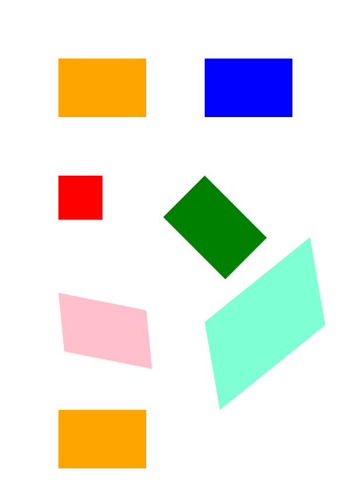

## **Transform a content in PS Document**
In this article, we consider how to make different transformations: translation, scaling, rotation, and shearing onto a rectangle path added to **PsDocument**.

We split one code snippet into several pieces of code: the beginning, the end, and each transformation separately. A transformation in PostScript is made always in a graphics state that is bound by **"gsave"** and **"grestore"** operators. Therefore in our PsDocument, there are methods **"WriteGraphicsSave()"** and **"WriteGraphicsRestore()"**. Between these methods, we can add any content, including nested graphics state, and make any transformations or clipping. These transformations will not affect outer graphics states but will do on nested ones.
If we make a transformation without **"WriteGraphicsSave()"** and **"WriteGraphicsRestore()"** methods we make it in the graphics state of the upper level and all content that is in PsDocument will be undergone by this transformation.
<br>
<br>
An algorithm for setting any transformation on a document's content from scratch includes the following steps:
1. Create an output stream for the resulting PS file.
2. Create [PsSaveOptions](https://reference.aspose.com/page/net/aspose.page.eps.device/pssaveoptions/).
3. Create [PsDocument](https://reference.aspose.com/page/net/aspose.page.eps/psdocument/) with the already created output stream and save options.
4. Save a graphics state. So we created a new graphics state, the previous graphics state was put in a graphics states stack.
5. Add necessary transformation: translation, scale, rotation, shear, or any combination of it. In our code, we show the influence of every transformation component separately and 3 ones at a time in the end.
6. Add necessary content that is required to transform. In our case, we created a rectangle **System.Drawing.Drawing2D.GraphicsPath** from the rectangle and then fill it. We created one rectangle before any transformations and just fill it after every transformation in the current graphics state.
7. Restore the graphics state to return back to the previous one where applied transformation(s) doesn't affect. In our case, it is an upper-level graphics state.

In this piece of code, we create PsDocument from an output stream and PsSaveOptions, translate upper-level graphics state to points 100,100 in order to offset the first rectangle, and finally create the first rectangle **System.Drawing.Drawing2D.GraphicsPath** from the rectangle.
```C#
//Create an output stream for PostScript document
using (Stream outPsStream = new FileStream(dataDir + "Transformations_outPS.ps", FileMode.Create))
{
    //Create save options with default values
    PsSaveOptions options = new PsSaveOptions();

    // Create new 1-paged PS Document
    PsDocument document = new PsDocument(outPsStream, options, false);

    document.Translate(100, 100);

    //Create graphics path from the rectangle
    System.Drawing.Drawing2D.GraphicsPath path = new System.Drawing.Drawing2D.GraphicsPath();
    path.AddRectangle(new System.Drawing.RectangleF(0, 0, 150, 100));
```
Here we set **Orange** color as the current paint for the upper-level graphics state and fill this rectangle. 

The resulting PS file will demonstrate the first shape that is located in the upper-level graphics state and is not undergone any transformation.
```C#
////////////////////////////////////// No transformations ///////////////////////////////////////////////////////////////
    //Set a paint in graphics state on upper level
    document.SetPaint(new System.Drawing.SolidBrush(Color.Orange));

    //Fill the first rectangle that is on on the upper-level graphics state and that is without any transformations.
    document.Fill(path);
/////////////////////////////////////////////////////////////////////////////////////////////////////////////////////////
```

 
Now we create a new graphics state that will be translated on 250 points by X-axis relatively to the upper-level graphics state and add to these new graphics state the same rectangle path painted with **Blue** color.
In the end, we exit from the current graphics state on the upper-level graphics state.
```C#
////////////////////////////////////// Translation //////////////////////////////////////////////////////////////////////

    //Save the graphics state in order to return back to this state after transformation
    document.WriteGraphicsSave();

    //Displace current graphics state on 250 to the right. So we add translation component to the current transformation.
    document.Translate(250, 0);

    //Set the paint in the current graphics state
    document.SetPaint(new System.Drawing.SolidBrush(Color.Blue));

    //Fill the second rectangle in the current graphics state (has translation transformation)
    document.Fill(path);

    //Restore the graphics state to the previus (upper) level
    document.WriteGraphicsRestore();
/////////////////////////////////////////////////////////////////////////////////////////////////////////////////////////
```
Translate upper level graphics state in order to put the next rectangles.
```C#
    //Displace on 200 to the bottom.
    document.Translate(0, 200);
```
Here we create a graphics state that will be scaled on 0.5 by X-axis and 0.75 by Y-axis and add to these new graphics state the same rectangle path painted with **Red** color.
In the end, we exit from the current graphics state on the upper-level graphics state.
```C#
////////////////////////////////////// Scaling //////////////////////////////////////////////////////////////////////////
    //Save the graphics state in order to return back to this state after transformation
    document.WriteGraphicsSave();

    //Scale current graphics state on 0.5 in X axis and on 0.75f in Y axis. So we add scale component to the current transformation.
    document.Scale(0.5f, 0.75f);

    //Set the paint in the current graphics state
    document.SetPaint(new System.Drawing.SolidBrush(Color.Red));

    //Fill the third rectangle in the current graphics state (has scale transformation)
    document.Fill(path);

    //Restore the graphics state to the previus (upper) level
    document.WriteGraphicsRestore();
//////////////////////////////////////////////////////////////////////////////////////////////////////////////////////
```
Translate the upper-level graphics state in order to put the next rectangles.
```C#
    //Displace upper level graphics state on 250 to the right.
    document.Translate(250, 0);
```
Then we create a new graphics state that will be rotated 45 degrees clockwise relative to the upper-level graphics state and add to these new graphics state the same rectangle path painted with **Green** color.
In the end, we exit from the current graphics state on the upper-level graphics state.
```C#
////////////////////////////////////// Rotation //////////////////////////////////////////////////////////////////////
    //Save the graphics state in order to return back to this state after transformation
    document.WriteGraphicsSave();

    //Rotate current graphics state on 45 degrees around origin of current graphics state (350, 300). So we add rotation component to the current transformation.
    document.Rotate(45));

    //Set the paint in the current graphics state
    document.SetPaint(new System.Drawing.SolidBrush(Color.Green));

    //Fill the fourth rectangle in the current graphics state (has rotation transformation)
    document.Fill(path);

    //Restore the graphics state to the previus (upper) level
    document.WriteGraphicsRestore();
//////////////////////////////////////////////////////////////////////////////////////////////////////////////////////
```
Translate the upper-level graphics state in order to put the next rectangles in the blank space on the page.

```C#
    //Returns upper level graphics state back to the left and displace on 200 to the bottom.
    document.Translate(-250, 200);
```
Then we create a new graphics state that will be sheared and add to this new graphics state the same rectangle path painted with **Pink** color.
In the end, we exit from the current graphics state on the upper-level graphics state.
```C#
////////////////////////////////////// Shearing //////////////////////////////////////////////////////////////////////
    //Save the graphics state in order to return back to this state after transformation
    document.WriteGraphicsSave();

    //Shear current graphics state. So we add shear component to the current transformation.
    document.Shear(0.1f, 0.2f);

    //Set the paint in the current graphics state
    document.SetPaint(new System.Drawing.SolidBrush(Color.Pink));

    //Fill the fifth rectangle in the current graphics state (has shear transformation)
    document.Fill(path);

    //Restore the graphics state to the previus (upper) level
    document.WriteGraphicsRestore();
//////////////////////////////////////////////////////////////////////////////////////////////////////////////////////
```
Translate the upper-level graphics state in order to put the next rectangles in the blank space on the page.

```C#
    //Displace upper level graphics state on 250 to the right.
    document.Translate(250, 0);
```
Now we create the last graphics state that will be undergone by complex transformation containing translation, scaling, and rotation components and add to this new graphics state the same rectangle 
path painted with **Aquamarine** color.
In the end, we exit from the current graphics state on the upper-level graphics state.
```C#
////////////////////////////////////// Complex transformation ////////////////////////////////////////////////////////
    //Save the graphics state in order to return back to this state after transformation
    document.WriteGraphicsSave();
	
    //Transform current graphics state with complex transformation. So we add translation, scale and rotation components to the current transformation.
    document.Transform(new System.Drawing.Drawing2D.Matrix(1.2f, -0.965925f, 0.258819f, 1.5f, 0f, 50));
	
    //Set the paint in the current graphics state
    document.SetPaint(new System.Drawing.SolidBrush(Color.Aquamarine));
	
    //Fill the sixth rectangle in the current graphics state (has complex transformation)
    document.Fill(path);
	
    //Restore the graphics state to the previus (upper) level
    document.WriteGraphicsRestore();
//////////////////////////////////////////////////////////////////////////////////////////////////////////////////////
```
Translate the upper-level graphics state in order to put the last rectangle in the blank space on the page.
```C#
    //Returns upper level graphics state back to the left and displace on 200 to the bottom.
    document.Translate(-250, 200);
```
The last filled rectangle that we put again in the upper-level graphics state shows that it was not undergone by transformations of graphics states of the lower level and changing of colors in it.
Orange color is left current paint.
```C#
////////////////////////////////////// Again no transformation ////////////////////////////////////////////////////////
    // Demonstrates that current graphics state's color is orange that was set up at the beginning of the code. 
    //Fill the seventh rectangle in the current graphics state (has no transformation)
    document.Fill(path);
//////////////////////////////////////////////////////////////////////////////////////////////////////////////////////
```
Finally we close the current page and save the document.
```C#
    //Close current page
    document.ClosePage();

    //Save the document
    document.Save();
}
```
{}
See working with transformations in PS document in [Java](/page/java/ps/working-with-transformations/) and [C++](/page/cpp/ps/working-with-transformations/).
{}

The result of running this code is the next
</br></br></br>
<p align="center">
	
</p>
</br></br></br>


{}
You can download examples and data files from [GitHub](https://github.com/aspose-page/Aspose.Page-for-.NET). {} 
